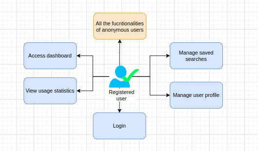
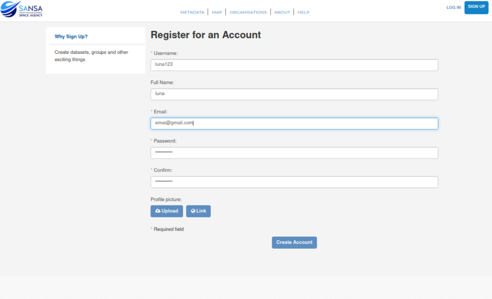
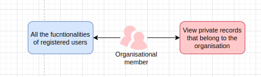
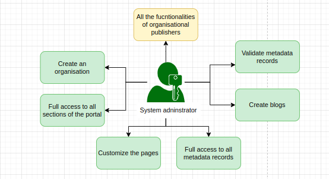
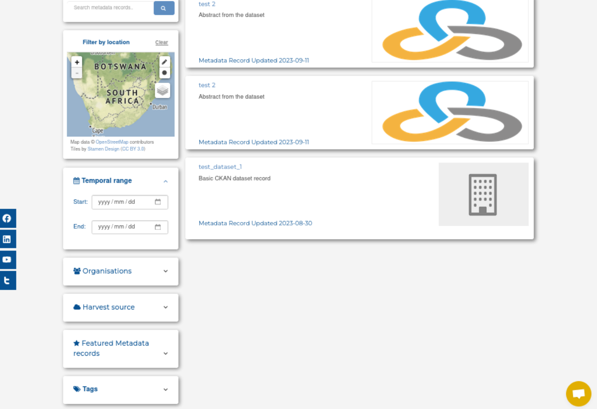
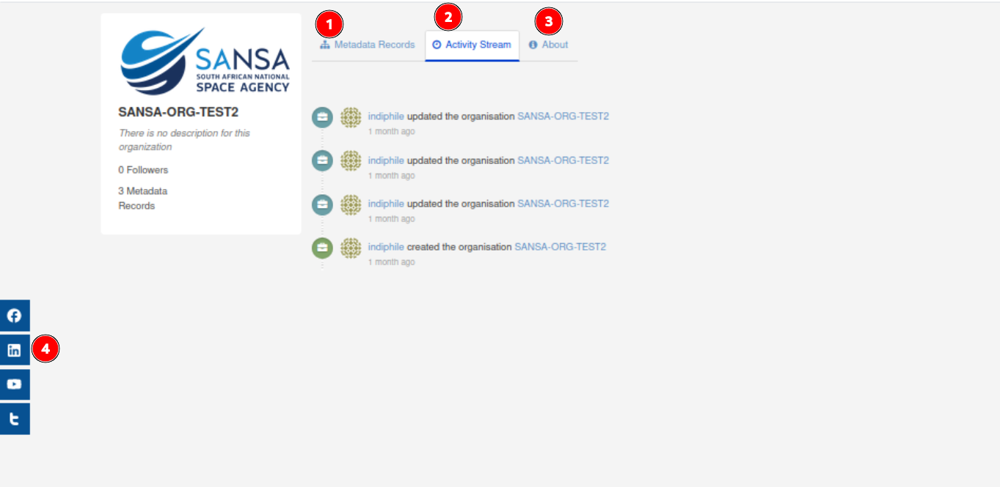

# User roles

Access to data and functionalities on the SAEOSS-Portal platform is governed by user roles and permissions. User roles define a default set of permissions generally assigned to different types of users and linked to their profiles. When a new user profile is registered, it is automatically assigned to the general user role.

Individual permissions can be set by the administrator for user profiles to provide additional access to data or functionalities if required. This means that even though a user profile is assigned to the general user role, it can have access to functionalities or permissions typically reserved for admin users. Additional user roles can also be created, or default user role permissions can be changed by an administrator with the relevant access.

## Six types of users

### 1. Anonymous user

This user has search, viewing and downloading capabilities of public metadata records. This user role is not required to register, nor are they a member of any organisation.

### 2. Registered user

This is a general user that has registered themselves on the system. By registering, this user has access to additional features such as the ability to save and delete searches, alter profile information, generate API key. This user is not a member of any organisation, but can access public metadata record.

User can register by filling out this form.

### 3. Member

This user role is a privileged user, who is part of a known institution or company. They must register on the SAEOSS Portal and provide additional information about their affiliation. This role is a member of an organisation that can view private metadata records that belong to the organisation they belong to.

If you would like to see which organisation you are a part of, you can click on the drop-down menu located under your username and select `Dashboard`. Then navigate to the `My Organisation` tab.

### 4. Editor

This user role is a privileged user, who is part of a known institution or company. They must register on the SAEOSS Portal and provide additional information about their affiliation. This role is a member of an organisation that has permission to create (but not publicly publish), edit and delete metadata records on the portal in the organisations where they are a member.

### 5. Publisher

This user role is a privileged user who is part of a known institution. They have the power to publish metadata records for consumption by the public as well as to create, delete and edit metadata records that are owned by their organisation. Metadata publishers are also able to manage other users’ permissions to their metadata records. There can be multiple users with this role within an organisation.This is the highest level of access on an organisational level.

### 6. System Administrator

A user role that possesses full access permissions, being able to configure and maintain all aspects of the SAEOSS Portal.

All users have access to the following pages:

1. **Metadata**: Users can search and view public metadata. They can filter by title, location, time, organisation, harvest source, features and tags.
    
2. **Map**: Users can search and view different layers.
    
3. **Organisation**: Users can navigate the organisations page and view the list of organisations on the portal. When users click on the organisations, it navigates to the profile of the organisation, where the users can view the organisation's public metadata records, activity stream, information about the organisation under 'About' and social media links for the organisation.
    
4. **About**: Users can access everything on the About page.
5. **Help**: Users can access the Help page, which takes them directly to this documentation.
