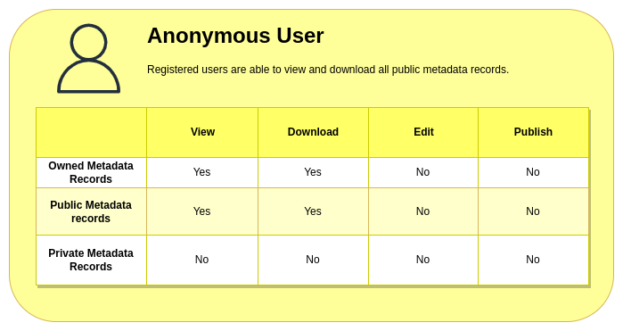
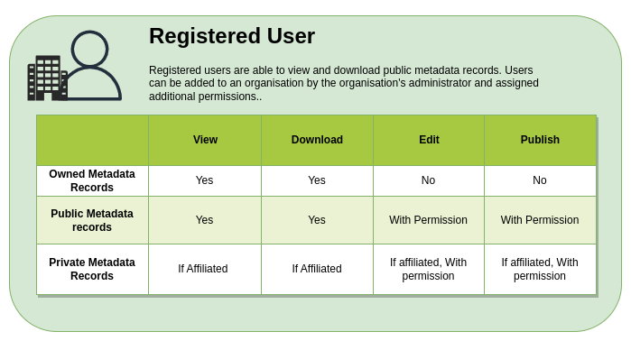

# User Roles
<!-- Different User Personas/Roles -->

Access to data and functionalities on the SAEOSS-Portal platform is governed by user roles and permissions. User roles define a default set of permissions generally assigned to different types of users and linked to their profiles. When a new user profile is registered, it is automatically assigned to the general user role.

Individual permissions can be set by the administrator for user profiles to provide additional access to data or functionalities if required. This means that even though a user profile is assigned to the general user role, it can have access to functionalities or permissions typically reserved for admin users. Additional user roles can also be created, or default user role permissions can be changed by an administrator with the relevant access.

### 3 Main Types Of Users:

### Anonymous User:

This user role is defined and assigned to people visiting the SAEOSS-Portal platform without logging into an account. Even if a user has registered for an account on the platform but does not log in, their experience will be limited to the functionalities and permissions of an anonymous user.

#### Functionalities
- Anonymous users are generally limited to logging in/registering, viewing public data, or downloading public data.

### Registered User:

The Registered user role (also referred to as a general user) is assigned to any registered user account by default once a new account has been registered. In addition to having the same functionalities and permissions as anonymous users, this role can also be affiliated with an organisation. Once a user account has been affiliated with an organisation, users will be able to view private data uploaded by the organisation and not made public.

Users with this role will also enjoy extra benefits such as the ability to follow any organisation or dataset they are interested in and receive updates on activities via the news feed dashboard and email notifications.

Because the user can be identified by their account, it is possible to assign extra functionalities to the account, like the ability to publish datasets or edit/approve datasets. All of these functionalities can be assigned by the administrator.

#### Functionalities
- Has the same functionalities as Anonymous users
- Can follow organisations or data they are interested in
- Can receive notifications of interest via the news feed dashboard or email
- Can have extra functionalities or permissions assigned by admin users
- Can be affiliated with an organisation
    - Can view the organisation's private datasets
    - Publish metadata records - If given permission by admin
    - Edit metadata records - If given permission by admin

### Admin User:

The admin user role is the most powerful user role and is reserved for users who are decision-makers or leaders within organisations and possess technical skills. The role of an administrator might not always be technical but will primarily include tasks such as publishing data and assigning permissions to other users. Admin users will also be responsible for affiliating users with organisations and can create new user profiles for users who have not registered an account.

Admin users are held responsible for the activities of an organisation and its members, and they are part of the team tasked with maintaining uploaded data. Because of these tasks, this role is usually assigned to team leaders or data custodians within an organisation.

#### Functionalities
- Has the same functionalities as an Anonymous User
- Has the same functionalities as a Registered User
- Can view private metadata records of affiliated organisations
- Can publish metadata records
- Can edit metadata records
- Can create users
- Can assign users
- Can change/add user permissions
- Can reset user passwords

### Additional User Roles or Permissions

The three primary user roles are usually sufficient for most tasks. However, exceptional situations may demand additional permissions for certain users. Additional permissions can be requested from the administrator and assigned to the user account.

In exceedingly rare instances where an entirely new user role becomes necessary, the system administrator possesses the capability to create one. This flexibility ensures that users can accomplish their duties effectively, even when confronted with unusual requirements.
