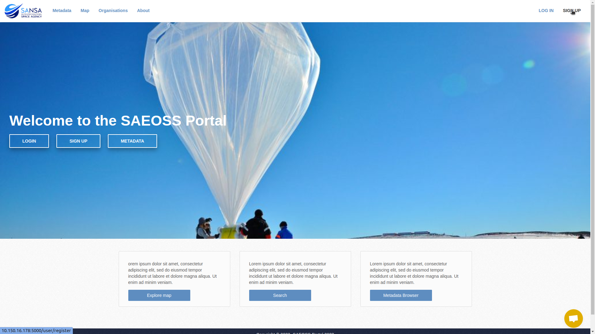
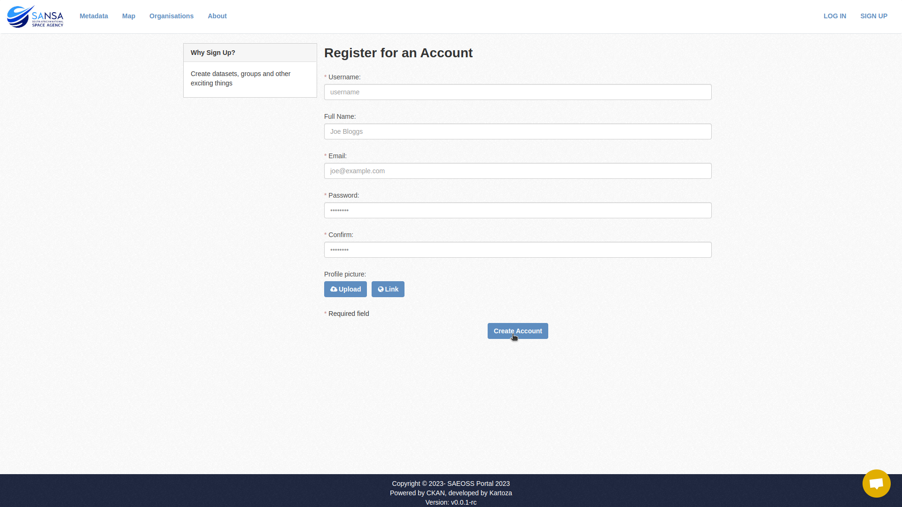
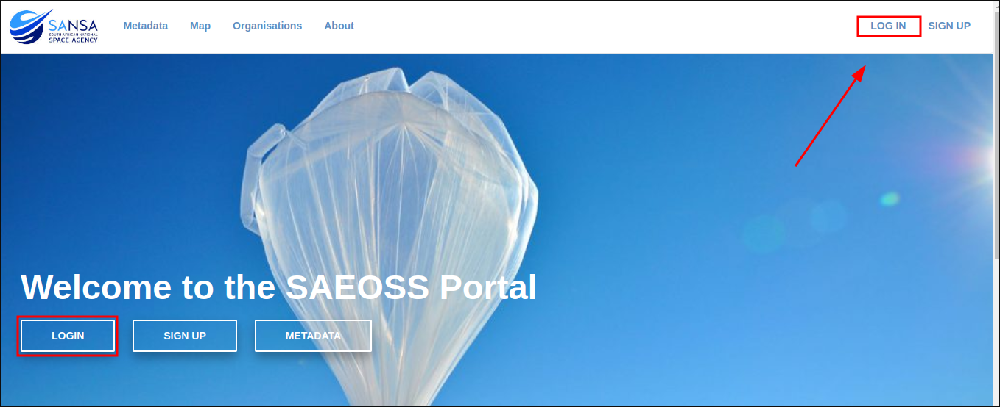
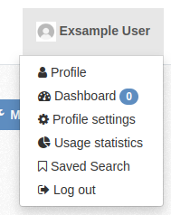

# SAEOSS-Portal Quickstart

## Accessing the Platform
<!-- Link to platform + landing page -->

### Registration

1. Go to the sign up page:

    

2. Fill in user’s form and click create account

    
    

### Logging In
Once a user profile has been registered, user are able to login.

1. From the home page, select login to be directed to the login page:

2. Complete the required fields and click on login:

3. Once successfully logged in the dashboard will be displayed. 

### Dashboard
The dashboard server as a collector of information to the user can displayes all recent activities of the user profile and that of orgenisations followed by the user.

Users can navigate to the dashboard easily from anywhere by selecting their provile picture in the top right-hand corner, then select dashboard from the list. 

### News Feed
The news feed lists all recent activities of items followed. As a new user this should display recent activity of your own profile. 

### My Metadata Records
In this section all metadata records uploaded by the user are displayed. By defult users are not able to upload new datasets. If required the user can request permissions from the administrator to have this functonality enabled. 

### My Orgenisations
In this section the user will see all orgenisations they form part of.

### My Groups
In this section the user will be able to see any groups they form part of. 