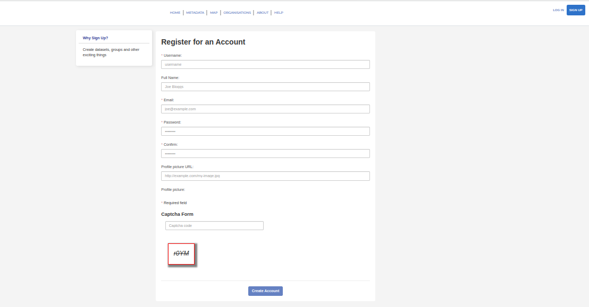
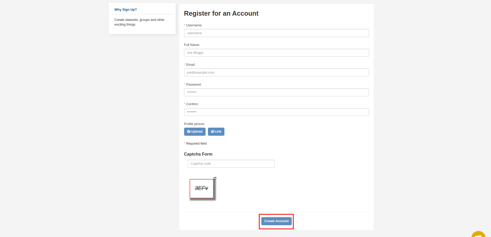

# Quickstart

## Getting Started
<!-- Easy to follow instructions for getting started using
the product -->
The workflows described in this section is designed to be 5 minute workflows to get users started with using the platform. For more detailed workflows please review the [user guide](../guide/index.md) section or the [user manual](../manual/index.md) section which describes the platform in page-by-page detail.

### Accessing the SAEOSS-portal

1. From your browser navigate to [{TBD}](http://www..)
2. If you don't have one, [register](#register-a-new-account) and create a user account.
3. Browse, view and download metadata.

### Register a new account

1. From the home page, in the top right corner locate and click on `SIGN UP`.
        
2. Complete the registration form. Ensure all required fields, marked with an `*`, have been completed.
        
3. Finally click on `Create Account`.
        

### Browse, view and download metadata

1. From the home page click on `Metadata` located in the navigation bar.
2. Search for relevant metadata using the search and filter fields in the left pane
3. Click on the title of appropriate metadata result to view the metadata record
4. Click on `explore` to preview or download the metadata record

<!-- 
### Releases -->

<!-- Insert links to release pages 
[GitHub releases page]()
[Releases page]()
-->