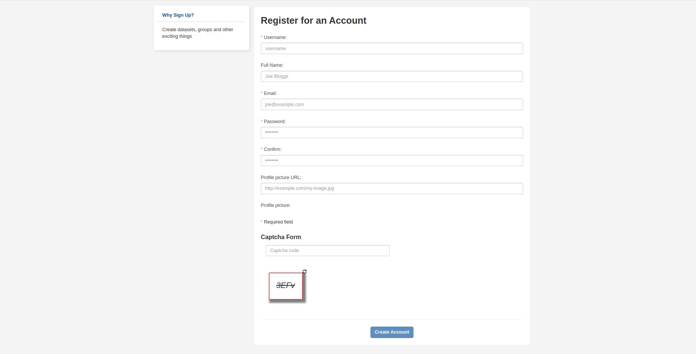

# Quickstart

## Getting Started

The workflows described in this section is designed to be 5 minute workflows to get users started with using the platform.  Please look at the [user guide](../guide/index.md) for more detailed workflows or look at the [user manual](../manual/index.md) section which describes the platform in page-by-page detail.

### Accessing the SAEOSS-portal

1. From your browser navigate to [{TBD}](http://www..)
        
2. If you don't have one, [register](#register-a-new-account) and create a user account.
3. [Browse, view and download metadata](#browse-view-and-download-metadata).

### Register a new account

1. From the home page, in the top right corner locate and click on `SIGN UP`.
        
2. Complete the registration form. Ensure all required fields, marked with an `*`, have been completed.
        
3. Finally click on `Create Account`.
        

### Browse, view and download metadata

1. From the home page click on `Metadata` located in the navigation bar.
        
2. Search for relevant metadata using the search and filter fields in the left pane
        
3. Click on the title of appropriate metadata result to view the metadata record
        
4. Click on `explore` to preview or download the metadata record
        
